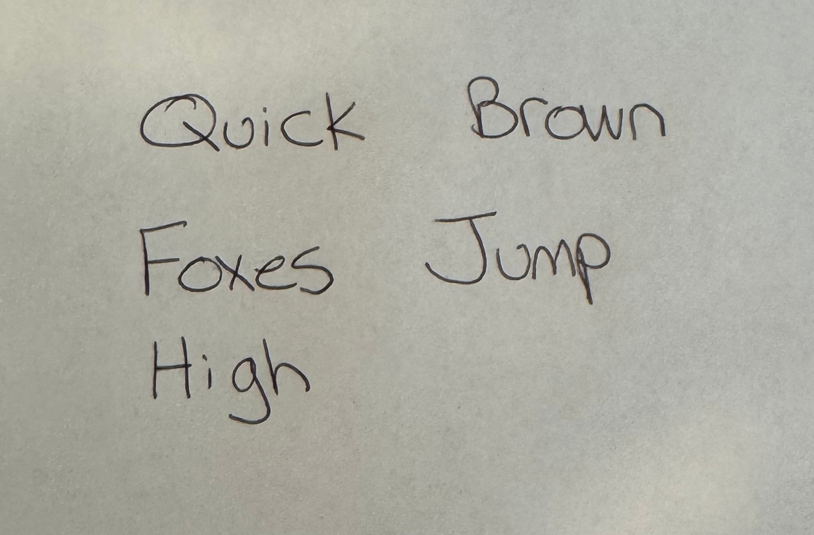
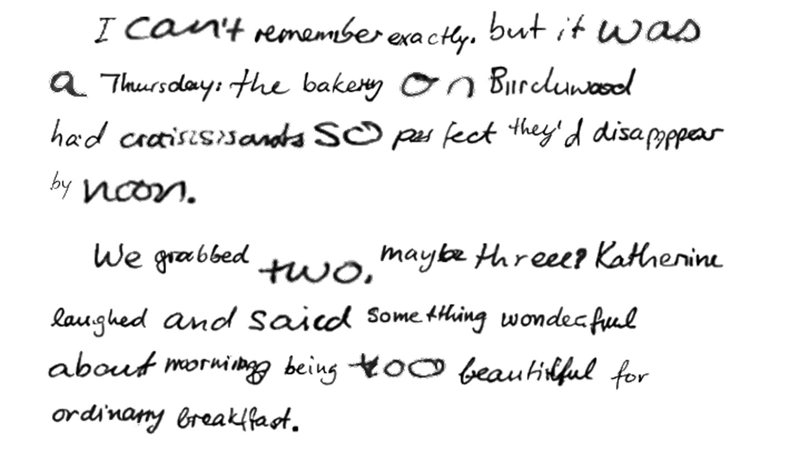

# Reforge

Reforge generates handwritten notes from text. You provide a photograph of someone's handwriting (a sentence of 5 words) and the text you want written. Reforge segments the handwriting sample into individual words, extracts the writer's style, and generates arbitrary English text in that style as a grayscale PNG. Multi-line and multi-paragraph output is supported.

The system is built on [DiffusionPen](https://github.com/koninik/DiffusionPen) (ECCV 2024), a diffusion model trained on the IAM handwriting dataset. Reforge wraps DiffusionPen in a full production pipeline: preprocessing, quality-aware generation, multi-layer postprocessing, cross-word harmonization, and page composition.

## Example

**Style input** (a photograph of 5 handwritten words) **->** **Generated output** (43 words, two paragraphs):

<p>

&nbsp;&nbsp;&rarr;&nbsp;&nbsp;

</p>

[Output history](docs/OUTPUT_HISTORY.md) tracks quality improvement over time.

```bash
python reforge.py \
    --style styles/hw-sample.png \
    --text "The morning sun cast long shadows across the quiet garden. Birds sang their familiar songs while dew drops sparkled on fresh green leaves.\nShe sat near the old stone wall, reading her favorite book. The pages felt warm and soft under her fingers." \
    --output result.png
```

### What this is not

- Not real-time. Batch generation takes ~3 seconds per word on an RTX 4000.
- Not a training system. DiffusionPen weights are frozen; reforge is inference-only.
- Not multilingual. The IAM dataset is Latin script only (80-character ASCII subset).
- Not a web app. CLI-first, library-second.

---

## How It Works

Reforge processes text through seven pipeline stages. Each stage applies specific CV techniques to transform raw model output into clean, readable handwritten pages.

### 1. DiffusionPen: the generative model

DiffusionPen is a latent diffusion model conditioned on both text content and handwriting style. It operates in a 64x256 pixel latent space, generating one word at a time. The model takes three inputs:

- **Text conditioning**: a character sequence tokenized by Google's Canine-C encoder, injected via cross-attention
- **Style conditioning**: visual features from 5 reference word images, injected via timestep embedding
- **Noise**: a random latent that the model iteratively denoises over 50 DDIM steps

The model has a hard architectural constraint: exactly 5 style images are required. The UNet reshapes style features with a literal `y.reshape(b, 5, -1)` followed by mean-pooling. This means the style input must always be a 5-word sentence.

Reforge adds everything around DiffusionPen: segmenting the style photograph into words, encoding them, orchestrating per-word generation, cleaning up artifacts, normalizing sizes, and composing words into pages.

### 2. Preprocessing: style image segmentation

The input photograph goes through:

1. **Adaptive thresholding** (Gaussian, 31x31 kernel) converts the grayscale photo to binary, handling uneven lighting across the page.
2. **Morphological dilation** with adaptive horizontal kernels bridges gaps between letters within words, preparing for connected-component analysis.
3. **Connected-component extraction** (8-connectivity) identifies word regions. Noise is filtered by area and minimum dimension thresholds.
4. **Reading-order sorting** clusters components into lines by Y-centroid proximity, then sorts left-to-right within each line.

Each extracted word is then individually processed:

- **Deskew** via `cv2.minAreaRect()` on ink pixels, correcting slant up to 30 degrees. White fill prevents dark border artifacts.
- **CLAHE** (Contrast-Limited Adaptive Histogram Equalization, 4x4 tiles, clip limit 2.0) normalizes contrast without over-amplification.
- **Aspect-preserving resize** to the model's input dimensions (64x256), center-padded with white.
- **DiffusionPen normalization**: `(pixel/255 - 0.5) / 0.5`, mapping white to +1 and black to -1. Not ImageNet normalization.

### 3. Style encoding

A MobileNetV2 backbone (pretrained on ImageNet, fine-tuned with triplet loss on IAM writer pairs) extracts visual style features. Each of the 5 word images produces a 1280-dimensional feature vector. These raw features are passed directly to the UNet without pooling.

The triplet-loss encoder generalizes better to unseen handwriting than the alternative class-based encoder, which is optimized for writers in the IAM training set.

### 4. Generation: DDIM sampling with quality gates

For each word in the input text:

1. **Adaptive canvas width**: 256px for words up to 8 characters, scaling linearly to 320px for 9-10 character words. Rounded to multiples of 16 for the UNet's convolutional architecture.

2. **Syllable splitting**: words longer than 10 characters are split using a scoring function that considers chunk balance, consonant-cluster boundaries, and a minimum of 4 characters per chunk (the IAM training minimum). Each chunk is generated separately and stitched.

3. **DDIM sampling with classifier-free guidance (CFG)**: two UNet passes per timestep. The conditional pass uses the real text and style features. The unconditional pass uses a space token and zero-style features. Combined as `noise = uncond + 3.0 * (cond - uncond)`.

4. **Best-of-N selection**: 3 candidates are generated per word, ranked by a quality score that evaluates background cleanliness, ink density, edge sharpness (Sobel gradients), height consistency, and contrast.

5. **OCR rejection loop**: the winning candidate is evaluated by TrOCR (a transformer model trained on handwritten text recognition). If character-level accuracy falls below 0.3, the word is regenerated, up to 2 retries. This catches cases where the diffusion model produces plausible-looking but unreadable output.

### 5. Postprocessing: five defense layers against gray-box artifacts

DiffusionPen generates dark-gray backgrounds (~150-175 brightness) around word ink, especially for short words. A single threshold cannot distinguish ink from background. Five complementary layers handle this:

**Layer 1: Adaptive background estimation.** The 90th-percentile pixel value estimates the background level. Ink is defined as pixels below 70% of this estimate, adapting to each word's particular background shade.

**Layer 2: Body-zone noise removal.** The middle 60% of rows (20%-80%) defines the "body zone" where letter bodies live. Columns without at least 5% body-zone ink are blanked. Connected-component analysis on strong ink (<128) preserves columns that belong to the same character as body-zone-valid columns, preventing clipping of crossbars ("T"), ascenders ("t", "l"), and descenders.

**Layer 3: Transitive cluster filtering.** Continuous runs of ink columns are identified using a lenient threshold (<230, catching faint inter-letter strokes). Neighboring clusters within 20px are merged transitively: if A is near B and B is near C, all three form one group. Only groups with no neighbor in the main cluster are removed. This preserves words with natural letter spacing while removing truly isolated noise.

**Layer 3b: Word-level gray cleanup.** Gray fringe pixels (160-220) not adjacent to strong ink (<128) within a 5x5 dilation radius are set to white. This removes diffusion noise halos at the word level.

**Layer 4: Compositor ink-only compositing.** During page composition, only pixels below brightness 200 are written to the canvas. Faint background pixels are not transferred.

**Layer 5: Post-upscale halo cleanup.** After 2x bicubic upscaling, interpolation creates gray halos around sharp edges. Strong ink is dilated by 4px, and gray pixels (128-230) outside this dilated region are blanked.

### 6. Quality normalization

After generation and postprocessing, words are normalized for visual consistency:

**Font size normalization** uses a unified height strategy. Short words (1-3 characters) are normalized by ink height to a 32px target, preventing single characters from filling the entire 64x256 canvas. Longer words (4+ characters) target a slightly higher ink height (~35px) to account for denser ink. Scale factors are clamped to [0.3, 1.6].

**Height harmonization** scales words toward the median ink height. Words exceeding 120% of median are scaled down; words below 80% of median are scaled up. This two-sided approach reduces the height variance that causes uneven baselines.

**Stroke weight harmonization** computes the median ink brightness for each word, then shifts each word's ink toward the global median with a blend factor of 0.85. This reduces the jarring effect of adjacent words having inconsistent line thickness.

### 7. Composition: page layout

Words are arranged on a page with:

- **Baseline detection**: a top-down density scan from the midpoint of each word's ink region, looking for the row where ink density drops below 15%. Handles looped descenders (g, y) by requiring no body-density rows below the candidate baseline.
- **Line wrapping**: words are placed left-to-right until they exceed the page width (800px minus 30px margins), then wrap to a new line with 12px spacing.
- **Paragraph layout**: None sentinels in the word list trigger paragraph breaks with 30px spacing and 40px indent.
- **Baseline-aligned compositing**: words on the same line share a baseline computed from the maximum baseline offset, aligning descenders and ascenders naturally.
- **2x upscaling** with bicubic interpolation for the final output, followed by Layer 5 halo cleanup.

---

## Testing and the Agentic Coding Loop

Reforge is developed using an experiment-driven workflow where Claude Code autonomously iterates on output quality. The test infrastructure is designed so the agent can make a change, measure its effect numerically, and decide whether to keep or revert it, without requiring human visual inspection.

### The core idea: CV metrics replace human eyes

Every quality dimension is reduced to a float in [0, 1]. The agent reads numbers, not pixels:

| Metric | What it measures | How |
|--------|-----------------|-----|
| `check_gray_boxes()` | Rectangular gray artifacts | Connected-component rectangularity on gray (140-220) pixels |
| `check_ink_contrast()` | Ink-to-background separation | Mean brightness difference, normalized to 200 |
| `check_background_cleanliness()` | Isolated noise in background | Gray pixel ratio excluding anti-aliasing near ink |
| `check_stroke_weight_consistency()` | Cross-word ink uniformity | Standard deviation of per-word ink medians |
| `check_word_height_ratio()` | Word size consistency | Max/min ink height ratio |
| `check_baseline_alignment()` | Vertical alignment per line | Standard deviation of bottom positions |
| `ocr_accuracy()` | Readability | TrOCR character recognition vs. target text, Levenshtein distance |

`overall_quality_score()` combines these into a single number. OCR accuracy is the dominant factor (40% weight). If any word scores below 0.5 on OCR, the overall score is capped at 0.45, preventing aesthetically clean but unreadable output from passing.

### Three test tiers

| Tier | Runtime | GPU | What it validates |
|------|---------|-----|-------------------|
| **Quick** (102 tests) | <1s | No | All metric functions, scoring logic, layout, preprocessing, charset validation. Everything mocked. Runs on every commit (pre-commit hook). |
| **Medium** (30 tests) | ~2 min | Yes | Real model generation with quality assertions. A/B comparisons, OCR accuracy gates, quality regression tracking. |
| **Full** (e2e) | ~10 min | Yes | Complete pipeline with real style images. Visual output saved to `tests/full/output/` for inspection. |

```bash
make test-quick     # quick tests only
make test           # medium tests (default)
make test-full      # full e2e tests
make setup-hooks    # install pre-commit hook (runs quick tests on every commit)
```

### The feedback loop

```
  Make a change (adjust threshold, modify postprocessing, tune parameter)
       |
       v
  Run tests/medium/ --> numeric metrics for every quality dimension
       |
       +---> All pass?  --> Commit, move to next task
       |
       +---> Failure?   --> Which metric failed? By how much?
                |
                v
          Run diagnostic instrument
                |
                v
          Identifies which pipeline stage caused the regression
          (e.g., "Layer 3 removed 47 columns from right 25%")
                |
                v
          Adjust that specific stage, re-run tests
```

### Key instruments

**Quality regression test** (`test_quality_regression.py`). Generates 5 fixed words across 3 fixed seeds (42, 137, 2718), computes all metrics, and compares against a recorded per-seed baseline in `quality_baseline.json`. Only metrics in `PRIMARY_METRICS` (the metric(s) selected by the Spearman correlation analysis in `docs/metric_correlation.md`) gate the build; the rest are diagnostics that print on regression but do not fail. A primary metric that drops by more than 0.05 on any seed fails the test. Baseline updates are manual only via `pytest tests/medium/test_quality_regression.py --update-baseline -x -s`; auto-ratcheting was removed to prevent silent baseline drift.

**OCR rejection loop** (inside `generate_word()`). During generation, each word's best candidate is evaluated by TrOCR. If character accuracy is below 0.3, the word is regenerated up to 2 times. This is a generation-time quality gate: the agent's postprocessing changes can affect what passes this gate, creating a direct feedback signal.

**Postprocessing diagnostic** (`diagnose_postprocessing()`). Traces a word image through each defense layer, reporting:
- Ink extent near left/right edges before and after each layer
- Number of ink columns removed from each edge region
- OCR accuracy before vs. after each layer

This pinpoints the exact layer responsible for any character clipping. The diagnostic was used to identify that Layer 3 (isolated cluster filter) was responsible for 8 out of 12 words losing characters in an earlier version, leading to the transitive-merge fix.

**Per-word quality scoring** (`quality_score()`). Used during best-of-N candidate selection. Evaluates Sobel edge gradients, ink density, contrast, background cleanliness, and height consistency. The winning candidate feeds into the OCR rejection loop, creating a two-stage quality funnel: aesthetic quality first, then readability.

### A/B experiments

The A/B harness (`experiments/ab_harness.py`) runs structured comparisons between parameter variants:

```bash
python experiments/ab_harness.py --style styles/hw-sample.png --experiment cfg
```

Predefined experiments compare CFG scale (1.0 vs 3.0 vs 5.0 vs 7.5), schedulers (DDIM vs DPM++ vs UniPC), postprocessing strategies, and combined parameter sets. For each variant, the harness:

1. Generates N candidates per word across multiple runs
2. Computes `overall_quality_score()` on each
3. Tracks mean and standard deviation across runs
4. Generates a labeled comparison PNG showing each variant's best output alongside its metrics
5. Accumulates results in `experiments/output/results.json`

The comparison images and metrics JSON give the agent two channels of feedback: numeric scores for pass/fail decisions, and visual comparisons for understanding why one variant wins.

### Where the agent "inspects" images

Claude Code is multimodal. It can read PNG files directly, viewing the actual generated handwriting. The system exploits this at several points:

- **result.png** after demo.sh: the agent reads the final output image to spot issues that metrics miss (e.g., "words look like white blocks are occluding them", which led to the word-clipping diagnostic and fix).
- **A/B comparison PNGs**: side-by-side variant images with labels and metrics overlaid. The agent sees which variant looks better and confirms the numeric ranking.
- **Diagnostic tracing**: the `diagnose_postprocessing()` function reports numeric deltas, but the agent can also read intermediate images at each layer to understand what's being removed.
- **test/full/output/**: e2e test outputs saved as PNGs. The agent reads these to validate that composed pages look correct beyond what metrics capture.

This dual-channel approach (numeric metrics for automated decisions, visual inspection for novel failure modes) is what makes the agentic loop effective. Metrics handle the 90% case. When a human looks at the output and says "words are being clipped", the agent builds a diagnostic instrument, finds the root cause numerically, fixes it, and adds a test so the same failure class is caught automatically going forward.
