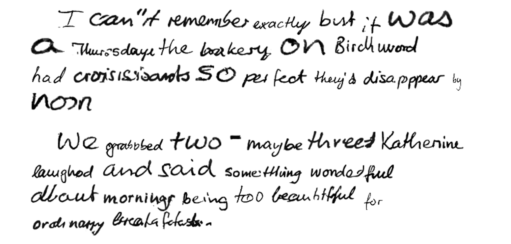
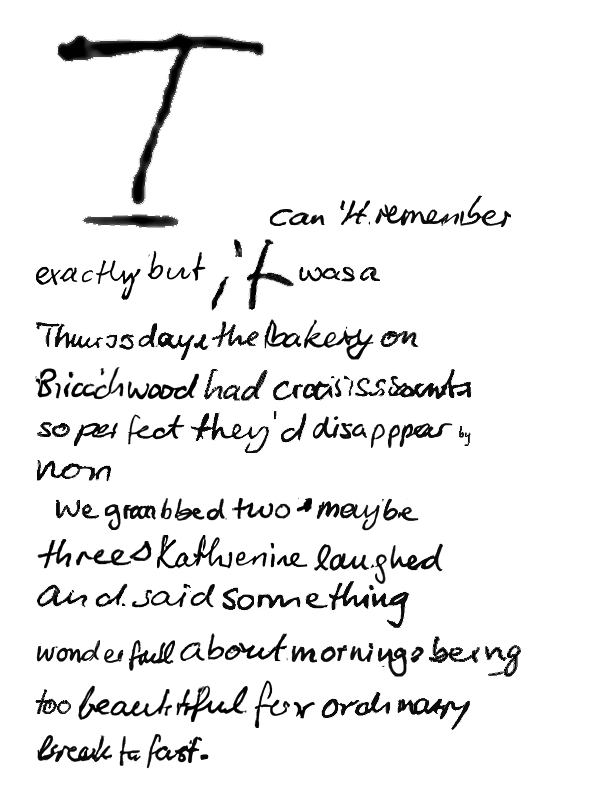
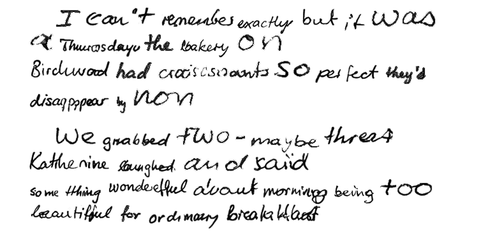
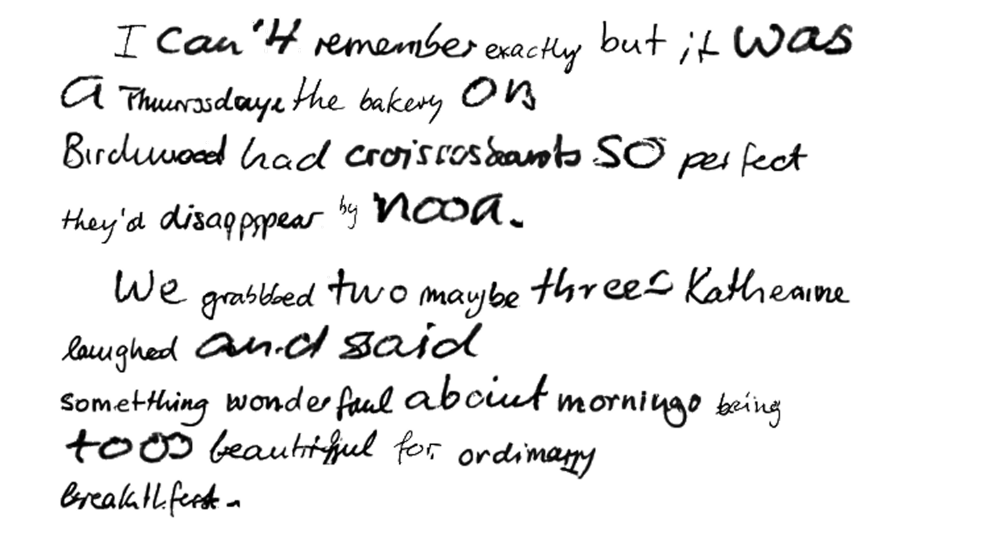
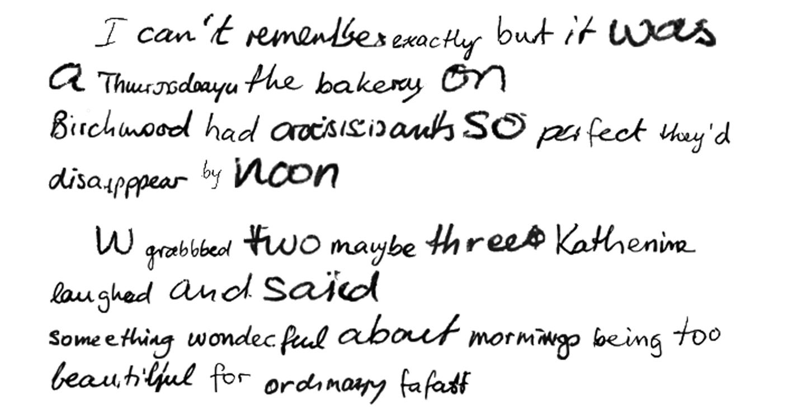
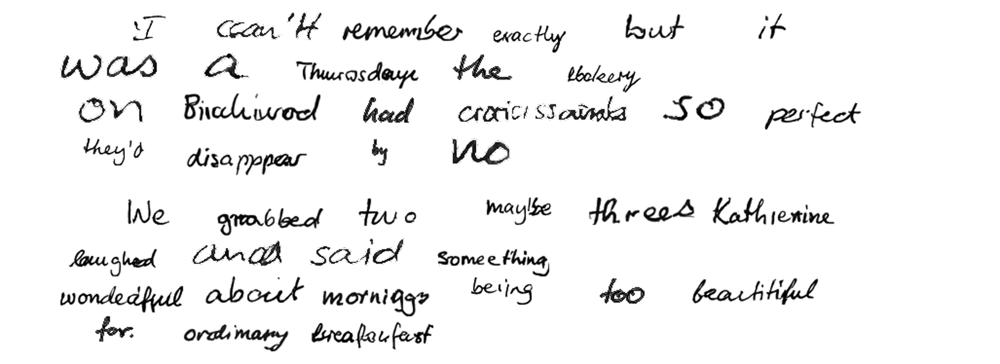
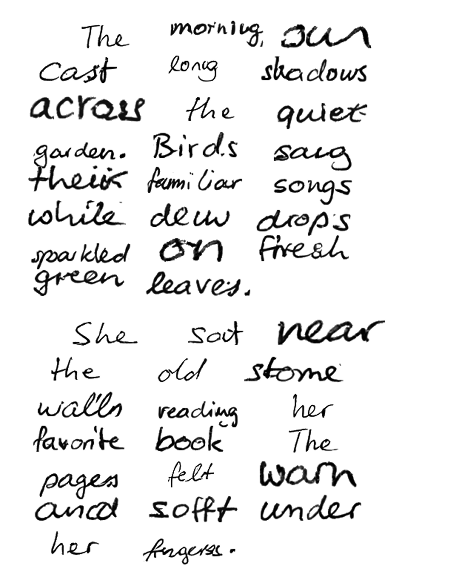

# Output History

Historical record of demo output quality over time. Each entry captures the
generated image, git state, quality metrics, and style input used. Newest first.

See [README](../README.md) for current output and project overview.

---

## 20260409-041732

| Field | Value |
|-------|-------|
| Git state | `485f4db (uncommitted changes)` |
| Commit message | Spec: add ragged right margin fix (lines waste 28-42% of width) |
| Style input | `styles/hw-sample.png` |
| Metrics | overall=0.793, composition_score=0.352, stroke_weight_consistency=0.916, word_height_ratio=1.000, ocr_accuracy=0.900, style_fidelity=0.358, ink_contrast=1.000, background_cleanliness=1.000 |

---

## 20260404-021856

| Field | Value |
|-------|-------|
| Git state | `485f4db (uncommitted changes)` |
| Commit message | Spec: add ragged right margin fix (lines waste 28-42% of width) |
| Style input | `styles/hw-sample.png` |
| Metrics | overall=0.868, composition_score=0.895, stroke_weight_consistency=0.922, word_height_ratio=0.926, ocr_accuracy=0.927, style_fidelity=0.359, ink_contrast=1.000, background_cleanliness=1.000 |

---

## 20260404-004824

| Field | Value |
|-------|-------|
| Git state | `9ba4caf (uncommitted changes)` |
| Commit message | Remove output history entry 20260401-220816 |
| Style input | `styles/hw-sample.png` |
| Metrics | overall=0.828, composition_score=0.570, stroke_weight_consistency=0.916, word_height_ratio=1.000, ocr_accuracy=0.900, style_fidelity=0.358, ink_contrast=1.000, background_cleanliness=1.000 |

---

## 20260404-004051

| Field | Value |
|-------|-------|
| Git state | `9ba4caf (uncommitted changes)` |
| Commit message | Remove output history entry 20260401-220816 |
| Style input | `styles/hw-sample.png` |
| Metrics | overall=0.828, composition_score=0.570, stroke_weight_consistency=0.916, word_height_ratio=1.000, ocr_accuracy=0.900, style_fidelity=0.358, ink_contrast=1.000, background_cleanliness=1.000 |

---

## 20260403-231951

| Field | Value |
|-------|-------|
| Git state | `3c2e054 (uncommitted changes)` |
| Commit message | Finding-driven quality iteration loop (14/14) |
| Style input | `styles/hw-sample.png` |
| Metrics | overall=0.828, composition_score=0.570, stroke_weight_consistency=0.916, word_height_ratio=1.000, ocr_accuracy=0.900, style_fidelity=0.358, ink_contrast=1.000, background_cleanliness=1.000 |

---

## 20260402-210446

| Field | Value |
|-------|-------|
| Git state | `d2a47f3 (uncommitted changes)` |
| Commit message | Codereview fixes: stale docstring, dead constants, import placement |
| Style input | `styles/hw-sample.png` |
| Metrics | overall=0.812, composition_score=0.427, stroke_weight_consistency=0.916, word_height_ratio=1.000, ocr_accuracy=0.900, style_fidelity=0.358, ink_contrast=1.000, background_cleanliness=1.000 |

---

## 20260402-053210

| Field | Value |
|-------|-------|
| Git state | `c1fc6aa (uncommitted changes)` |
| Commit message | Spec implementation: QA trust scoring, demo quality gate, experiment logging |
| Style input | `styles/hw-sample.png` |
| Metrics | overall=0.891, composition_score=0.855, stroke_weight_consistency=0.906, word_height_ratio=1.000, ocr_accuracy=0.967, style_fidelity=0.386, ink_contrast=1.000, background_cleanliness=1.000 |

---

## 20260401-201338

| Field | Value |
|-------|-------|
| Git state | `6bdbe1c (uncommitted changes)` |
| Commit message | New spec: output quality, composition, style fidelity, generation tuning |
| Style input | `styles/hw-sample.png` |
| Metrics | overall=0.999, ink_contrast=1.000, background_cleanliness=0.998 |

---
