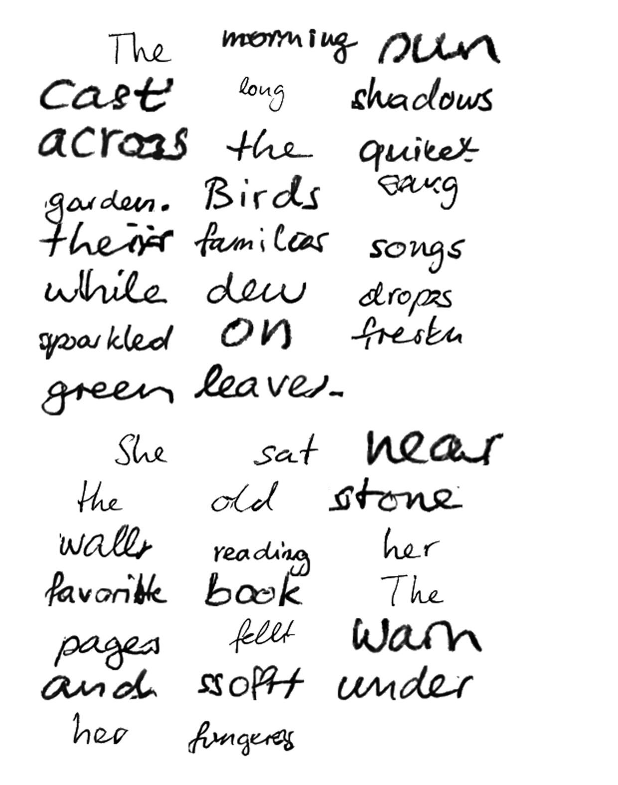
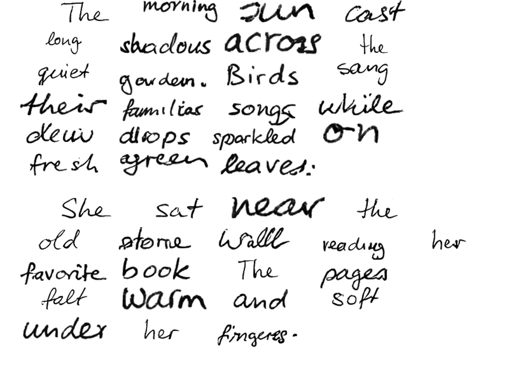

# Output History

Historical record of demo output quality over time. Each entry captures the
generated image, git state, quality metrics, and style input used. Newest first.

See [README](../README.md) for current output and project overview.

---

## 20260401-220816

| Field | Value |
|-------|-------|
| Git state | `a5172d7 (uncommitted changes)` |
| Commit message | Remove duplicate output history entry 20260401-202454 |
| Style input | `styles/hw-sample.png` |
| Metrics | overall=0.999, ink_contrast=1.000, background_cleanliness=0.998 |

---

## 20260401-201338

| Field | Value |
|-------|-------|
| Git state | `6bdbe1c (uncommitted changes)` |
| Commit message | New spec: output quality, composition, style fidelity, generation tuning |
| Style input | `styles/hw-sample.png` |
| Metrics | overall=0.999, ink_contrast=1.000, background_cleanliness=0.998 |

---
