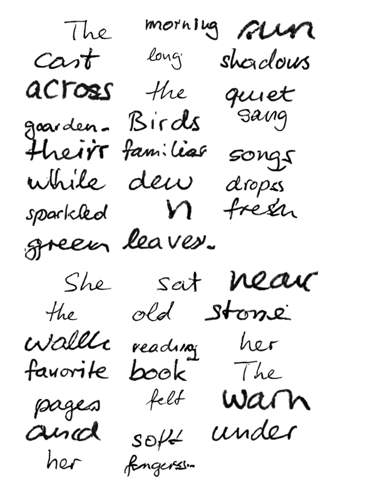
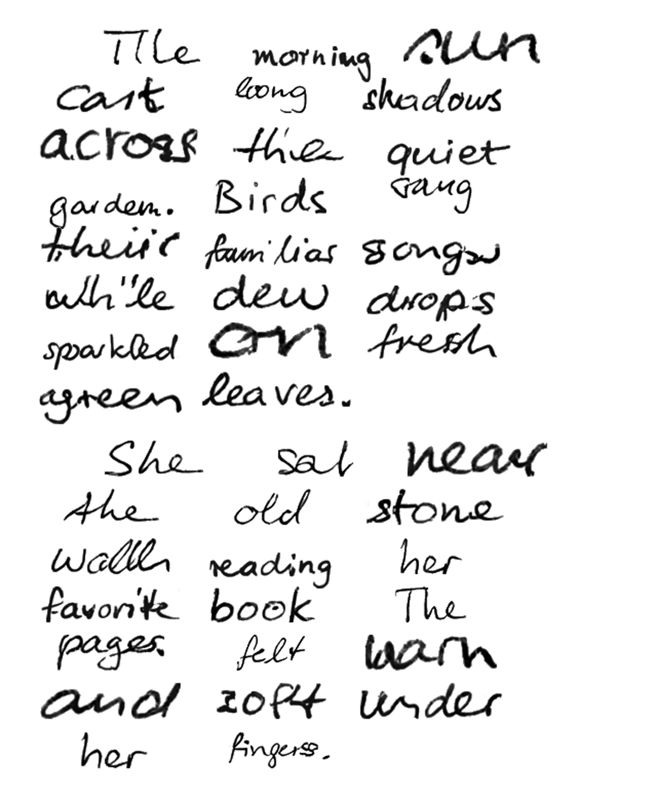

# Output History

Historical record of demo output quality over time. Each entry captures the
generated image, git state, quality metrics, and style input used. Newest first.

See [README](../README.md) for current output and project overview.

---

## 20260402-053210

| Field | Value |
|-------|-------|
| Git state | `c1fc6aa (uncommitted changes)` |
| Commit message | Spec implementation: QA trust scoring, demo quality gate, experiment logging |
| Style input | `styles/hw-sample.png` |
| Metrics | overall=0.891, composition_score=0.855, stroke_weight_consistency=0.906, word_height_ratio=1.000, ocr_accuracy=0.967, style_fidelity=0.386, ink_contrast=1.000, background_cleanliness=1.000 |

---

## 20260402-040549

| Field | Value |
|-------|-------|
| Git state | `99cbfce (uncommitted changes)` |
| Commit message | Codereview fix: handle missing continuous metrics in overall_quality_score |
| Style input | `styles/hw-sample.png` |
| Metrics | overall=0.891, composition_score=0.855, stroke_weight_consistency=0.906, word_height_ratio=1.000, ocr_accuracy=0.967, style_fidelity=0.386, ink_contrast=1.000, background_cleanliness=1.000 |

---

## 20260402-012542

| Field | Value |
|-------|-------|
| Git state | `2ef52b1 (uncommitted changes)` |
| Commit message | Review fixes: update stale docstrings, remove unused imports |
| Style input | `styles/hw-sample.png` |
| Metrics | overall=0.999, ink_contrast=1.000, background_cleanliness=0.997 |

---

## 20260401-220816

| Field | Value |
|-------|-------|
| Git state | `a5172d7 (uncommitted changes)` |
| Commit message | Remove duplicate output history entry 20260401-202454 |
| Style input | `styles/hw-sample.png` |
| Metrics | overall=0.999, ink_contrast=1.000, background_cleanliness=0.998 |

---

## 20260401-201338

| Field | Value |
|-------|-------|
| Git state | `6bdbe1c (uncommitted changes)` |
| Commit message | New spec: output quality, composition, style fidelity, generation tuning |
| Style input | `styles/hw-sample.png` |
| Metrics | overall=0.999, ink_contrast=1.000, background_cleanliness=0.998 |

---
